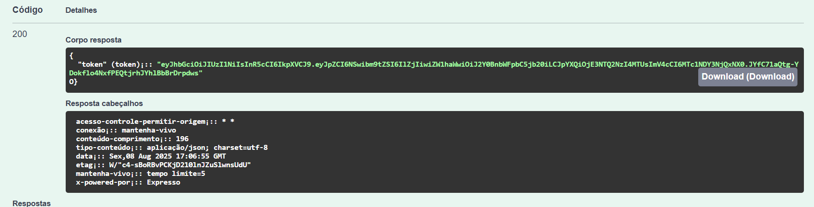

# API de Pedidos
Esta é uma API simples para gerenciar pedidos, desenvolvida como parte do curso de Programação Orientada a Objetos (PSOF) do SESI.


## Tecnologias
- **Node.js**: Ambiente de execução JavaScript no servidor.
- **Express**: Framework para construção de APIs em Node.js.
- **Prisma**: ORM para interagir com o banco de dados.
- **Swagger**: Documentação da API.

## Instalação
- 1 Clone este repositório e abra com o VsCode.
- 2 Crie o arquivo `.env` na raiz do projeto com as seguintes variáveis de ambiente:
```js
DATABASE_URL="mysql://root@localhost:3306/pedidosapi?schema=public&timezone=UTC"
SECRET_JWT="meu_segredo_jwt"
```
- 3 Abra o XAMPP de start no MySQL. No terminal, execute os seguintes comandos para instalar as dependências e criar o banco de dados:
```bash
npm install
npx prisma migrate dev --name init
```
4 Inicie o servidor com o comando:
```bash
npx nodemon
```
4 Clique nos links do console para acessar a documentação da API no Swagger.


# Aula01 - Testes de Software
## 1. Introdução
### 1.1. O que é um teste de software?
- Teste de software é um processo de execução de um programa com o objetivo de encontrar erros.
- O teste é uma atividade de execução de um sistema com o objetivo de encontrar falhas.

## Erro x Falha
- Erro: é a diferença entre o valor calculado e o valor correto.
- Falha: é a manifestação do erro durante a execução do programa.

## Falha e Defeito
- Falha: é a manifestação do erro durante a execução do programa.
- Defeito: é o erro no código fonte que causa a falha.

### Falha x Defeito segundo o ISTQB
- Falha: é a **incapacidade** de um sistema ou componente de executar suas funções requeridas dentro de requisitos especificados.
    - Ex: normalmente quando há uma falha o sistema **não funciona**.
- Defeito: é um desvio do comportamento especificado de um sistema ou componente.
    - Ex: o sistema funciona, mas **não funciona como deveria**.

## 2. Tipos de Testes
### 2.1. Teste de Unidade
- Teste de unidade é o teste de menor nível, é o teste de um único componente ou unidade do sistema.
- O teste de unidade é realizado pelo desenvolvedor, que testa cada unidade de código assim que é desenvolvida.
- Ex: Testes que realizamos no nosso banco de dados, alimentando com dados e verificando se os dados estão sendo salvos corretamente (CRUD).

### 2.2. Teste de Integração
- Teste de integração é o teste de um conjunto de unidades de código.
- O teste de integração é realizado pelo desenvolvedor, que testa o conjunto de unidades de código assim que são desenvolvidas.
- Ex: Utilizando a ferramenta Insomnia para testar as rotas da nossa aplicação.

### 2.3. Teste de Sistema (Ponto a Ponto)
- Teste de sistema é o teste de todo o sistema.
- O teste de sistema é realizado pelo desenvolvedor, que testa o sistema assim que é desenvolvido.

### 2.4. Teste de Aceitação
- Teste de aceitação é o teste realizado pelo usuário final, que testa o sistema assim que é desenvolvido.

## 3. Teste de Caixa Preta
- Teste de caixa preta é o teste realizado sem conhecer a implementação interna do sistema.

## 4. Teste de Caixa Branca
- Teste de caixa branca é o teste realizado conhecendo a implementação interna do sistema.

## 5. Roteiro de Testes
- Roteiro de testes é um documento que descreve os testes a serem realizados em um sistema. Normalmente no formato de tabela ou checklist.

## 6. Relatório de Testes
- Relatório de testes é um documento que descreve os resultados dos testes realizados em um sistema

## 7. Atividade Prática (Testando a API de Pedidos)
**[Neste repositório](https://github.com/wellifabio/pedidosapi-2025.git)**, você encontrará uma API de pedidos que desenvolvemos nas aulas de projetos anteriores. Sua tarefa é testar essa API utilizando os conceitos aprendidos nesta aula. Será um teste do tipo caixa branca, pois já conhecemos a implementação interna do sistema. Execute o projeto em seu computador e siga o roteiro de testes sugerido:

### Roteiro de Testes - Caixa Branca
- 1 **Teste de Unidade**: A partir da página de documentação da API swagger, verifique todas as rotas estão funcionando corretamente.
    - **Usuários**:
    - [x] Rota de Login de usuário
        - [x] Credenciais corretas retornaram um token JWT
        
        - [ ] Credenciais incorretas retornaram erro 400(Retornam erro **401**)
        
    - [x] Rota de criação de usuário
        - [x] Usuário criado com sucesso (Código 201)
        
        - [ ] Usuário co e-mail já existente retornou erro 400 (Retornou erro 500)
        
        - [ ] A rota está protegida por autenticação JWT(Qualquer um pode criar)
        
        - [ ] A rota deveria estar protegida por autenticação JWT(Não deveria)
    - [x] Rota de listagem de usuários
        - [x] Listagem de usuários retornou sucesso
        
        - [x] A rota está protegida por autenticação JWT
        
        - [x] Listagem de usuários vazia retornou sucesso
        
    - [x] Rota de atualização de usuário
        - [x] Usuário atualizado com sucesso (Código 202)
        
        - [ ] Usuário não encontrado retornou erro 404 (Retornou erro **500**)
        
        - [x] A rota está protegida por autenticação JWT
        
    - [x] Rota de exclusão de usuário
        - [x] Usuário excluído com sucesso (Código 204)
        
        - [ ] Usuário não encontrado retornou erro 404(Retornou erro 500)
        
        - [x] A rota está protegida por autenticação JWT
        
    - **Produtos**:
    - [x] Rota de criação de produto
        - [x] Produto criado com sucesso (Código 201)
        
        - [x] A rota está protegida por autenticação JWT
        
    - [x] Rota de listagem de produtos
        - [x] Listagem de produtos retornou sucesso
        
        - [ ] A rota está protegida por autenticação JWT (**Não** está protegida)
        
        - [x] Listagem de produtos vazia retornou sucesso
        
    - [x] Rota de atualização de produto
        - [ ] Produto atualizado com sucesso (Código 202)
        
        - [ ] Produto não encontrado retornou erro 404 (Retornou erro **500**)
        
        - [x] A rota está protegida por autenticação JWT
        
    - [ ] Rota de exclusão de produto
        - [ ] Produto excluído com sucesso (Código 204)(Retornou erro 500)
        
        - [ ] Produto não encontrado retornou erro 404(Retornou erro **500**)
        
        - [x] A rota está protegida por autenticação JWT
        
    - **Pedidos**:
    - [x] Rota de criação de pedido
        - [x] Pedido criado com sucesso (Código 201)
        
        - [ ] Pedido com produto não existente retornou erro 400 (Retornou erro **500**)
        
        - [ ] Pedido com usuário não existente retornou erro 400 (Retornou erro **500**)
        
        - [x] A rota está protegida por autenticação JWT
        
    - [ ] Rota de listagem de pedidos
        - [x] Listagem de pedidos retornou sucesso
        
        - [x] A rota está protegida por autenticação JWT
        
    - [x] Rota de atualização de pedido
        - [x] Pedido atualizado com sucesso (Código 202)
        
        - [ ] Pedido alterado para produto não existente retornou erro 400 (Retornou erro **500**)
        
        - [ ] Pedido alterado para usuário não existente retornou erro 400 (Retornou erro **500**)
        
        - [x] A rota está protegida por autenticação JWT
        
    - [ ] Rota de exclusão de pedido
        - [x] Pedido excluído com sucesso (Código 204)
        
        - [ ] Pedido não encontrado retornou erro 404 (Retornou erro **500**)
        
        - [ ] A rota está protegida por autenticação JWT
    - **Exclusão de Usuarios e Produtos**:
        - [ ] Exclusão de usuário com pedidos cadastrados retorna erro 400
        (Retorna erro **500**)
        
        - [ ] Exclusão de produto com pedidos cadastrados retorna erro 400 (Retorna erro **500**)
        

## Relatório de Testes
- Após realizar os testes, elabore um relatório de testes contendo os resultados dos testes realizados (Basta preencher o checklist acima com os resultados dos testes). O relatório deve conter:
    - Data e hora dos testes
    - Nome do testador
    - Versão da API testada
    - Resultados dos testes (conforme checklist acima)
    - Observações adicionais

## Entrega
- O relatório de testes deve ser enviado para [Formulário de Entrega](https://docs.google.com/forms/d/e/1FAIpQLSfCboaFln7MUcw3EaXlHyEdgVhbmlirqxoE6RlztuXljlxigg/viewform?usp=dialog) em formato PDF com evidências de cada rota testada (prints de tela, abaixo de cada rota testada) até a próxima aula.